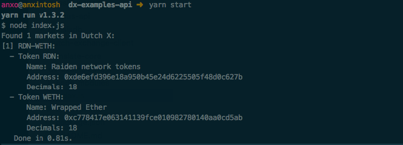

# API Usage - Dutch X
This is just a simple project that shows how to use the Dutch X API.

## Getting started
To get started, you just have to make a regulat REST call using any http client.

For example, in node you could use [got](https://www.npmjs.com/package/got) to 
make the http requests:

```bash
yarn add got --save # Or: npm install got  --save
```

Then we can invoke any of the Api operations. 

For example, to get the complete list of tokens pairs (markets) that has been 
added to the Dutch X we can use the `/markets` endpoint:

```js
got = require('got');
const { body: markets } = await got('https://dx-services.dev.gnosisdev.com/api/v1/markets', {
  json: true
})
```

The complete example can be seen in [here](index.js).

You can run it with:
```bash
yarn start # Or: npm start
```

We should see as a result the list of tokens:



# Documentation
For API documentation, please go to:
https://dx-services.dev.gnosisdev.com/

# Aditional information
For aditional information and for reference, check out the following 
repositories:

* [Gnosis Blog](https://blog.gnosis.pm/tagged/dutchx): Learn about Dutch X in 
Gnosis Blog, were you will find a series of posts about it.
* [Github: dx-contracts](https://github.com/gnosis/dx-contracts): Smart 
contracts of the Duch X
* [Github: dx-services](https://github.com/gnosis/dx-services): Services, 
repositories and bots to interact with DX.
* [Github: dx-examples-liquidity-bots](https://github.com/gnosis/): Example 
project and documentation on how to run your own bots to ensure market 
liquidity.
* [Github: dx-react](https://github.com/gnosis/dx-react): Front end web 
application for the Dutch X seller interface
